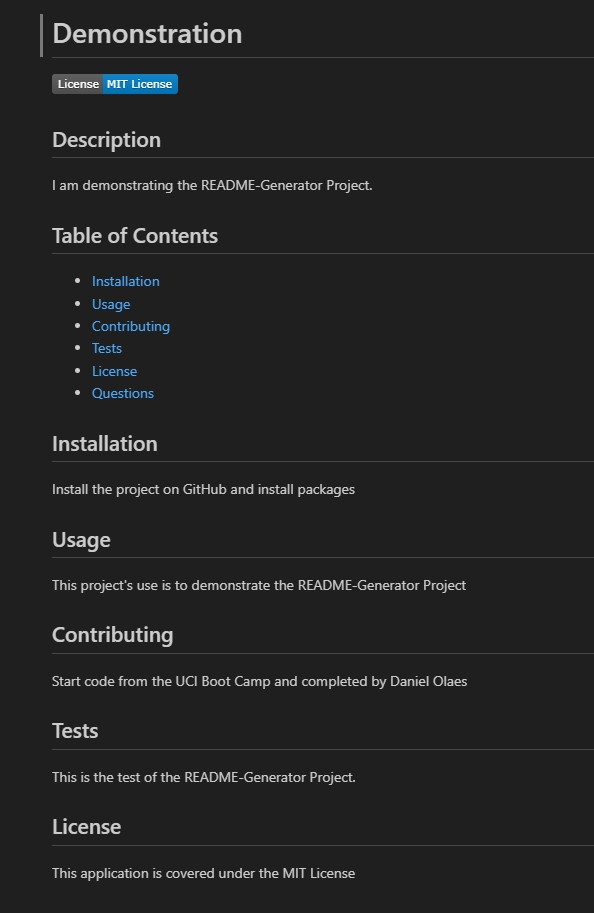

# README Generator

## Description
This project allows the user to answer input prompts in the console in order to automatically generator a professional README markdown file for a new project. This README.md file was created using this project and altered slightly after in order to provide more detail, such as images and spacing.

## Table of Contents
- [Installation](#installation)
- [Usage](#usage)
- [Contributing](#contributing)
- [Tests](#test)
- [Questions](#questions)

## Installation
In order to install this project, please download or clone the repository at the following link: https://github.com/dolaes/README-Generator. After downloading, please run "npm install inquirer" and "npm install fs" in the console to include the Inquirer and fs packages into the project.

## Usage
After completing the installation steps, please run "node index.js" to launch the project. Please answer all of the question prompts. After completing the prompts, a README.md file will appear, or if it already exists, will be updated in your file directory.

## Contributing
Starter code provided by UCI Software Development Boot Camp.
Project completed by Daniel Olaes.

## Tests
In order to test the project, please answer the question prompts and ensure that the README.md file produced accurately reflects what you entered. In addition, for the license badge, link, and section, if the user selects "None", the 3 previously mentioned sections will not be present in the final product.

## Questions
For questions, reach out at:
- GitHub: [dolaes](https://github.com/dolaes)
- Email: [danielolaes18@gmail.com](mailto:danielolaes18@gmail.com)